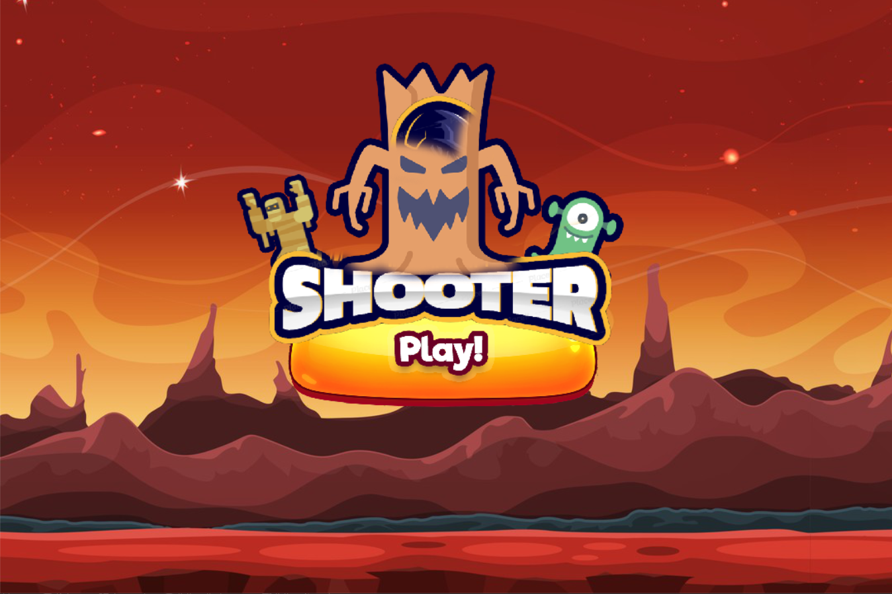

This game is based on a fight between one player vs many monsters and comets. The goal of the game is to kill all the monsters with projectiles to increase the score and survive the longest time possible.

The library used is called “pygame”.

To start the game, you need to execute the file “main.py”. The button ‘PLAY’ launches the game. The player can move right and left when the right and left arrows of the keyboard are pressed. He can also fight the monsters by pressing the button space. The score is displayed at the top left of the screen. The player’s and monster’s health gauge is displayed in green and it’s updated after each damage. When the red gauge is full, it’s time to get rid of comets that randomly fall from the sky.

